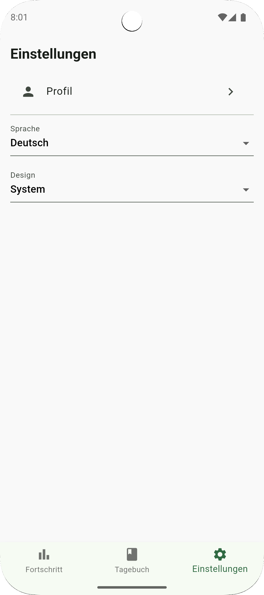

# 🥗 BalanceMeal
A Flutter-based nutrition tracking app that helps users document their meals, monitor calorie intake, and track progress over time.

### 🧩 What Problem Does It Solve?
Many people struggle to maintain a healthy diet simply because they lack awareness of what they consume. Whether they unintentionally eat too much or too little, misjudge the nutritional value of food, or don't have an easy way to track their intake — BalanceMeal offers a simple, structured solution.

With BalanceMeal, users can:

📝 Log meals and see exact nutritional values

🔥 Monitor daily calorie consumption

🧮 Track macronutrients like proteins, fats, and carbs

📈 Analyze progress through weight and calorie graphs

🎯 Set calorie goals and visually compare them to actual intake

### 🎯 Who Is It For?
Persona: Leonie, 28, Student & Fitness Enthusiast

Leonie has recently started focusing more on fitness and healthy eating. She works out three times a week and wants to lose a few kilos while maintaining her energy levels.
Before BalanceMeal, she often underestimated how much she was eating — especially on rest days.

She wants to:

✅ Keep track of her meals and macros

📊 Understand how food affects her weight over time

👀 Have visual feedback on her calorie limits

💡 Learn to eat more consciously

BalanceMeal gives her the tools to stay informed and consistent.

### 🖼 Screens Overview

<a href="https://raw.githubusercontent.com/montaser717/balance_meal/main/assets/github/diary_view.png"></a>
<a href="https://raw.githubusercontent.com/montaser717/balance_meal/main/assets/github/meal_edit_view.png"></a>
<a href="https://raw.githubusercontent.com/montaser717/balance_meal/main/assets/github/food_item_screen.png"></a>
<a href="https://raw.githubusercontent.com/montaser717/balance_meal/main/assets/github/settings_screen.png"></a>


📓 Diary	Log meals with their nutritional values (calories, macros)
📝 Meal Edit Add meals and insert Foods
👤 Settings	Manage account change Language and Appearance


## 🏗 Architecture

The Balance Meal application follows a **layer-first** architecture with focus on clear separation of concerns, inspired by modular architecture inspired by **MVVM principles**.

**Model Layer**

The Model layer represents the data and business objects of the app.
It includes data classes (e.g., Meal, FoodItem) and handles serialization, deserialization, and any transformation logic related to raw data.

**View Layer**

The View layer is responsible for the user interface.
It displays data received from the ViewModel and sends user interactions back to the ViewModel to handle.

**ViewModel**

The ViewModel (often implemented with Cubit or Bloc) acts as a bridge between the Model and the View.
It holds and manages the state of the UI, processes user inputs, interacts with services or repositories, and prepares data for the View.


## 🛠️ Getting Started

1. Clone the repository:
   ```bash
   git clone https://github.com/montaser717/balance_meal.git
   ```
2. Install dependencies:
   ```bash
   flutter pub get
   ```
3. Run the app locally:
   ```bash
   flutter run
   ```


👨‍💻 Developed by


Almontaser Fadel Najjar,  Bastian Romer and Omer Emurli